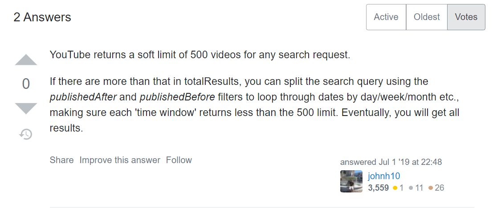
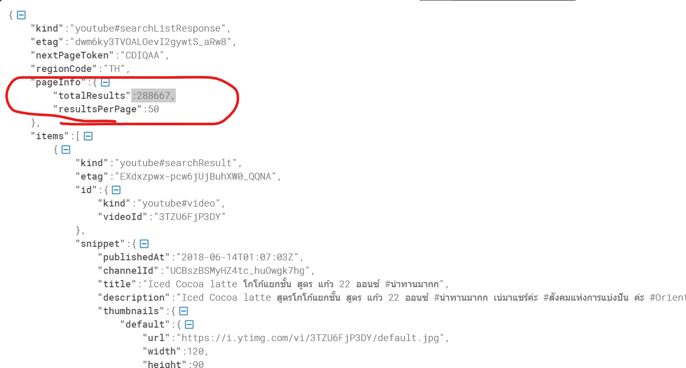

# Data Engineer
 Mini Project รายวิชา Basic of Data Engineer


``` 
'video_id' => items:id
'trending_date' => 
'title' => items:snippet:title
'channel_title' => items:snippet:channelTitle
'category_id' => items:snippet:categoryId
'publish_time' => items:snippet:publishedAt
'tags' => items:snippet:tags
'views' => items:statistics:viewCount
'likes' => items:statistics:likeCount
'dislikes' => items:statistics:dislikeCount
'comment_count' => items:statistics:commentCount
'thumbnail_link' => items:snippet:thumnails:standard:url
'comments_disabled' => 
'ratings_disabled' => 
'video_error_or_removed' => 
'description' => items:snippet:description
```

___
``` python
parameters = [
    part='snippet',
    location='13.736717, 100.523186'
    locationRadius='10mi',
    maxResults=50,
    order='viewCount',
    publishedAfter='2006-07-23T08:24:11.000Z',
    publishedBefore='2018-06-14T01:31:53.000Z',
    relevanceLanguage='TH',
    type='video',
]

TH = [
    13.736717, 100.523186
]
```
___
``` python
res.keys(), res['pageInfo'], res['items'][0]
```
``` python
(dict_keys(['kind', 'etag', 'nextPageToken', 'regionCode', 'pageInfo', 'items']),
 {'totalResults': 106065, 'resultsPerPage': 50},
 {'kind': 'youtube#searchResult',
  'etag': 'X-MFzA6TftodOWUtAIbHb_rCdvg',
  'id': {'kind': 'youtube#video', 'videoId': 'ftPBz0a9FJg'},
  'snippet': {'publishedAt': '2011-10-21T14:51:07Z',
   'channelId': 'UCzVaPlUrK_F-PHmn3nGUk0Q',
   'title': 'SRT : Thailand Big Flood 2011 HD , รถไฟไทยลุยน้ำท่วม 19.10.2011',
   'description': 'ขบวนรถพิเศษช่วยการโดยสาร ดอนเมือง - อยุธยา - ดอนเมือง การรถไฟแห่งประเทศไทย ช่วยบรรเทาความเดือดร้อน จากเหตุการอุทกภัย สามารถตรวจสอบการเดินทางได้โทร 1690 ...',
   'thumbnails': {'default': {'url': 'https://i.ytimg.com/vi/ftPBz0a9FJg/default.jpg',
     'width': 120,
     'height': 90},
    'medium': {'url': 'https://i.ytimg.com/vi/ftPBz0a9FJg/mqdefault.jpg',
     'width': 320,
     'height': 180},
    'high': {'url': 'https://i.ytimg.com/vi/ftPBz0a9FJg/hqdefault.jpg',
     'width': 480,
     'height': 360}},
   'channelTitle': 'GanzExpress - รถไฟไทย Thai Railway',
   'liveBroadcastContent': 'none',
   'publishTime': '2011-10-21T14:51:07Z'}})
```
___
วิธีแก้ปัญหาข้อมูลไม่มากไปกว่า 500 <br>

___
``` python
    Interest:
        2006-07-23T08:24:11.000Z => 2018-06-14T01:31:53.000Z
    
    Start split:
        2018-06-14T01:31:53.000Z
        2015-06-10T14:37:07Z
        2011-12-24T08:32:29Z
        2009-05-09T06:33:25Z
        2006-08-10T16:42:57Z

```
___
โดนข้อมูลหลอก <br>

___ 
``` python
```
